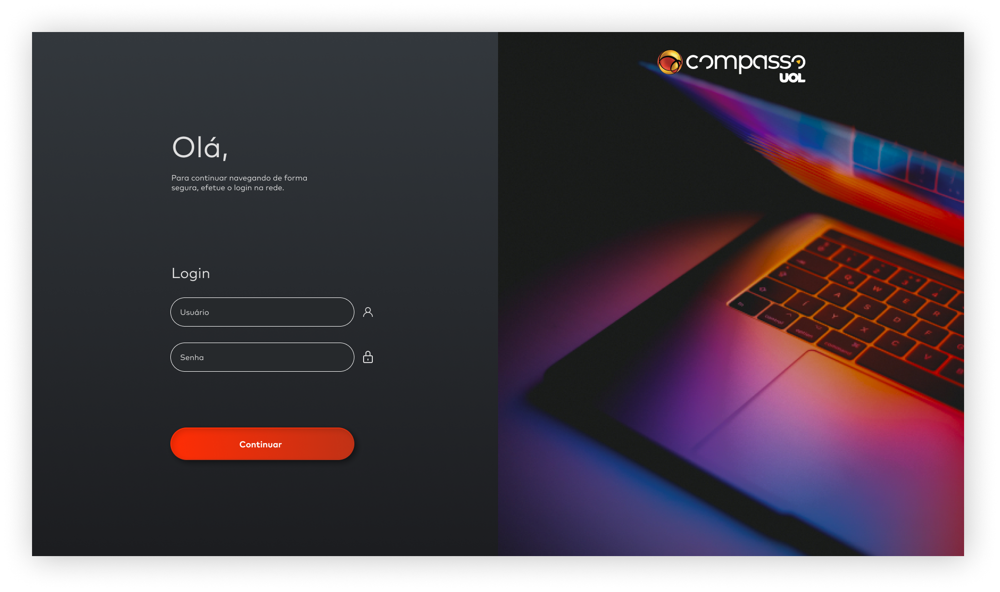
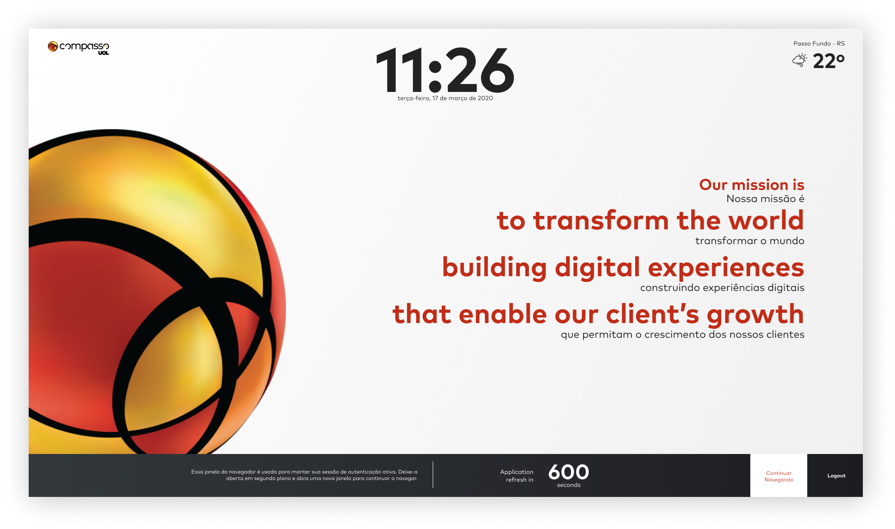

# Compass.UOL:  PB - Front-End React
## Projeto Final Sprint IV

### História:
Eu, como usuário, quero poder logar no website de colaboradores da Compass 
para que eu consiga acessar com segurança e usufruir das funcionalidades disponíveis.

### Cenário Atual:
Atualmente não temos um sistema e login num ambiente digital que promova 
uma maior integração e centralização de funcionalidade para colaboradores na Compass.⠀⠀⠀

### Cenário Desejado:
Desejamos um login que possa permitir uma boa usabilidade ao usuário.

### 🔨 Requisitos não-funcionais:
* Desenvolver com HTML, CSS e Javascript (podendo usar Bootstrap e SASS para estilização);
* Estrutura de pastas;
* Commits pequenos e coerentes;
* Utilização de ícones e fontes (podendo usar Nunito ou Poppins como opção);
* Lógica de Login com o usuário e senha, podendo ser apenas: "admin" e "admin";

### :computer:  Rquisitos funcionais:
* O sistema deve possuir duas telas: "login" e "home". Sendo a tela de "login" com tres estados diferentes de acordo com o layout;
* O sistema deve apresentar a hora atual e a data completa na tela "home";
* Ao fazer login, sistema deve apresentar uma mensagem de erro se os dados inseridos não forem validados;
* O sistema deve armezenar os dados de login no localstorage e deletá-los quando requeriodo;
* O sistema deve apresentar a localização do usuário e a previsão do tempo atual, caso esteja autorizado a usar a localização do dispositivo;
* O sistema deve ter um temporizador que mantem por 600 segundos a sessão do usuário;
* Quando o temporizador zerar, o sistema deve abrir uma janela pop-up para perguntar ao usuário se ele dejseja continuar a sessão ou encerrar;
* Se o usuário decidir encerrar a sessão, o sistema deve redirecioná-lo para a página de login, caso o contrario, o sistema deve atualizar a página "home";
* O sistema deve redirecionar o usuário para a página de "login" ao clicar em no botão logout;
* O sistema deve redirecionar o usuário para a página de notícias da UOL ao clicar no botão "continuar navegando";
* Ao clicar em "logout", o sistema deve abrir uma janela pop-up para perguntar ao usuário se ele deseja manter os dados de login salvos;

### :scroll: Layout:
  
  
  
  

 ### 	:keyboard: Desenvolvimento:
 #### :briefcase: Estrutura de pastas:
 <ul>
 <li>images</li>
 <li>pages
  <ul><li>home.html</li></ul>
 </li>
  <li>scripts
    <ul><li>home.js</li><li>login.js</li></ul>
  </li>
  <li>styles
    <ul><li>home.css</li><li>login.js</li></ul>
  </li>
  <li>index.html (página de login)</li> 
  </ul>
  
 #### ✔️ Tecnologias utilizadas:

- ``HTML``
- ``CSS``
- ``Javascript``
-  ``API WeatherAPI - Utilizada para previsão do tempo `` https://www.weatherapi.com/
-  ``API NominatimAPI - Utilizada para geocodificação``https://nominatim.org/release-docs/develop/api/Overview/
 
